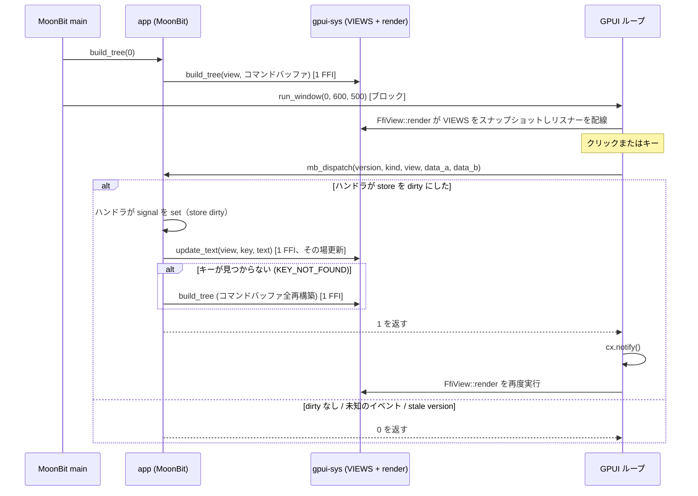

# アーキテクチャ（現状）

本プロジェクトが**現時点で**どのように組み上がっているかを、AI 向けに権威的に記述したドキュメント。これは実験的な、ネイティブ専用の Rust/GPUI ↔ MoonBit 統合であり、安定した汎用 UI API ではない。事実は具体的（ファイルパス、シンボル、シグネチャ）に記す。コードに合わせてこのファイルも更新すること。現行実装の詳細を書く権威はここであり、[`roadmap.md`](roadmap.md) は計画と進捗のみを扱う。

関連ドキュメント: [`architecture.html`](architecture.html)（本ドキュメントの図解版。構成図＋解説、ブラウザで開く）、[`README.md`](../README.md)（ビルド・実行）、[`moonbit-bindings/README.mbt.md`](../moonbit-bindings/README.mbt.md)、[`moonbit-native-notes.md`](moonbit-native-notes.md)（低レイヤの過去の観測記録）、[`troubleshooting.md`](troubleshooting.md)（過去のバグ）、[`framework-gaps.md`](framework-gaps.md)（フレームワーク化に向けたギャップ分析）。

## 1. これは何か

**Zed の GPUI**（Rust 製、GPU アクセラレーション UI）を、Rust/C の FFI 層を介して **MoonBit** から呼び出す。現在のデモはインタラクティブな Counter で、ボタン `-1`・`Reset`・`+1`・`+10`（横スクロールコンテナ内）、キー `j`・`k`・`r`、名前付きキー Enter/↑/↓/Escape、数字入力を備える。数字入力はアプリ級 `EVENT_TEXT` と、編集可能なテキスト入力ボックス（RFC 0003: Enter で確定→`input_text` で pull→クリア）の両方から受け付ける。UI の記述と Counter のロジックは MoonBit 側に、リテイン方式のツリー保存・レンダリング・GPUI イベントループ・ブリッジは Rust 側にある。

- **`main` は MoonBit が所有する**（`moon run` / バンドルされたバイナリ）。Rust はその実行ファイルにリンクされる静的ライブラリである。
- モデルは **retained + reactive** である。MoonBit がノードツリーを構築して Rust に保存し、GPUI がそれをレンダリングし、イベントは MoonBit へコールバックする。状態を変更するコールバックはツリーを更新（キー付きテキストのその場更新、または全再構築）して `1` を返す。何もしないコールバックは `0` を返す。Rust は `1` のときだけ GPUI に通知する。

## 2. 構成要素

| ディレクトリ | 言語 | 役割 | 主要ファイル |
|---|---|---|---|
| `gpui-sys/` | Rust | C ABI 越しに GPUI を公開する静的ライブラリ。ノードストア、レンダリング、イベントリスナー、ヘッドレステスト harness | `src/lib.rs`、`src/headless.rs`、`build.rs`、`abi.toml`、`cbindgen.toml`、`benches/`、`fuzz/` |
| `bindgen-moonbit/` | Rust | 生成された C ヘッダーをパースして MoonBit の FFI import 宣言にする CLI | `src/main.rs` |
| `moonbit-bindings/` | MoonBit | 高レベル API、合成 widget、フレームワーク層、dispatch の登録とライブラリ所有のエントリポイント、build driver 用の最小ランナー | `gpui-bindings.mbt`、`widgets.mbt`、`dispatch.mbt`、生成物 `gpui-bindings-ffi.mbt`、`cmd/main/main.mbt` |
| `examples/` | MoonBit | ライブラリを path 依存で消費する**別モジュール**のサンプルアプリ（Counter / hello / stream）。第三者が通る経路をそのまま踏む（RFC 0004 §4） | `counter/counter/counter.mbt`、`counter/main/main.mbt`、`hello/`、`stream/` |
| `tests/consumer/` | MoonBit | 消費者経路の回帰テスト。自前アプリを登録し `dispatch_entry` へイベントを注入して状態遷移を assert する（RFC 0004 §6-1） | `main/main.mbt` |
| ルート | shell / PowerShell | 言語横断のビルド orchestration とプラットフォームセットアップ | `build.sh`、`build.ps1`、`bundle.sh` |

ターゲットは MoonBit の `native`。サポートするホスト/ターゲットの組み合わせは macOS arm64 または x86_64、Linux x86_64（WSLg を含む）、Windows MSVC x64。クロスコンパイルはサポート対象外である。ツールチェーンの最低バージョンはこのリポジトリでは固定していない。ビルドドライバは観測したバージョンを表示し、Cargo.lock が依存解決を固定する（現在は GPUI 0.2.2 を含む）。

## 3. 実行時モデル（retained tree）

- Rust は `gpui-sys/src/lib.rs` に 1 つの静的ストアを保持する。
  - `static VIEWS: Mutex<Vec<Option<UiNode>>>` — view id ごとのコミット済みツリー。`render` は自分の view のスロットを読む。
  `UiNode` は `Div`・`Text { content, color, size }`・`TextInput { input_id, placeholder }`（RFC 0003）のいずれかである。`TextInput` は leaf ノードで（子を持たない）、編集バッファ・選択範囲・IME preedit はツリーではなく Rust 側のテキストモデルが保持する（下記のテキスト入力状態の項）。`Div` はレイアウト・スタイル・イベントの全属性を保持する: コア（`width`/`height`、`bg`、`flex`/`flex_col`、`center`、`gap`、`rounded`、`padding`、`border_width`/`border_color`、`on_click`、`key`、`children`）、G7/G9（issue #51: `bg_color` RGBA・`margin`・`min_size`/`max_size`・`flex_item`・`align`・`overflow`・`opacity`・`shadow`・`cursor`・`position`・`inset`・`padding_sides`）、G8 タイポグラフィ（`text_size`・`text_color`・`font_weight`・`line_height`・`text_align`・`whitespace`・`font_family`）、キーボードナビゲーション（issue #52: `focusable`・`tab_index`・`tab_stop`）。enum 型のスタイル値（align/justify/overflow/cursor/position/text_align/whitespace）は ABI id（`abi.toml` の各セクション）で保持され、`render_node` が gpui の型へマップする。
- ツリー構築は **コマンドバッファ**（issue #5）である。MoonBit は `CommandBuffer` に全ノードの記述を 1 つの length-delimited な opcode ストリームとして蓄積し、`build_tree(view, cb)` 1 回の FFI 呼び出しで送信する。Rust はこれをパースしてステージングツリーを組み、ルートとキー重複を検証し、成功時のみ `VIEWS[view]` へ差し替える。失敗時はステージング状態を破棄し、以前のコミット済みツリーは無傷である。
- コマンドバッファはスタックマシンである。ノード生成（`div`/`text`）がハンドルを内部スタックへ push し、セッターはスタックトップに適用され、`add_child` は child・parent の順に pop して parent を再 push し、`set_root` はトップを pop してルートにする。
- `FfiView::render` は、mutex を保持したまま自分の view のコミット済みルートをクローンして `VIEWS` をスナップショットし、mutex を解放してから GPUI の要素/リスナーを構築する。これによりロックをリスナーとコールバックの経路から外す。コミット済みツリーがなければ空で描画する。
- 外側の Rust レンダリングコンテナ（MoonBit が生成したルートノードではない）は全サイズの flex column で、`FfiView.focus` を追跡し `on_key_down` を受け取る。このリスナーは Tab / Shift+Tab を消費して `win.focus_next()` / `win.focus_prev()` を呼び（issue #52 のキーボードナビゲーション、MoonBit には転送しない）、それ以外のキーを通常の key/text dispatch へ流す。各 div の GPUI `ElementId` は次の優先順で決まる: 安定キーがあれば `"gpui_key:{key}"`、なければクリック可能 div は `("gpui_click", click_id)`、キーもクリックもないスクロール div は描画ごとの一時 id `("gpui_scroll", n)`、キーもクリックもない focusable div は一時 id `("gpui_focus", n)`。クリック可能な div には `on_click` リスナーが割り当てられる。
- 状態変更イベントの後、MoonBit はツリーを更新する。既定の正しい経路は新しいコマンドバッファでツリーをゼロから再構築して `build_tree` することである。Counter example（`examples/counter/counter/counter.mbt`）はまず `update_text(view, COUNT_KEY, …)` によるキー付きテキストノードの**その場更新**（issue #10）を試み、失敗（`GPUI_STATUS_KEY_NOT_FOUND`）時のみフルリビルドにフォールバックする。何もしないイベントは再構築も commit もスキップする。
- **安定ノード識別（issue #9）**: `set_key(key)` は div に明示的な安定キーを設定する。設定されたキーは GPUI の `ElementId`（`"gpui_key:{key}"`）になり、クリック有無に関わらず再構築を跨いで stateful element の同一性を保つ。キー未設定のクリック可能 div は従来どおり click_id から ID を合成する（`"gpui_click"`）。click_id はアクションルーティング専用であり、キーとは独立（click_id の重複は許容、キーの重複は `build_tree` が拒否）。
- **スクロール状態の保持（issue #51 G6）**: `OP_SET_OVERFLOW` で `SCROLL` を指定した軸を持つ div は実際のスクロールコンテナになる。`render_node` は各スクロール div に gpui の `ScrollHandle` を割り当てるが、ツリーは状態変更のたびにゼロから再構築されるため、ハンドルはツリーの外で保持される。保持先は view ごとの `FfiView.scroll_handles: Rc<RefCell<HashMap<String, ScrollHandle>>>` で、`OP_SET_KEY` の値をキーにする。`ScrollHandle` は `Rc` ベースで `Send` でないため、`Mutex` 下のグローバル `VIEWS` には置けず、メインスレッド専用である view エンティティ内に置く。キー付きスクロール div は再構築を跨いでスクロール位置を維持し、キーなしスクロール div は毎回の再構築で新しいハンドル（先頭位置）になる。スクロール追跡には element state が必要なため、スクロール div は常に GPUI id を持つ（キー付きは `"gpui_key:{key}"`、キーなしは一時 id `"gpui_scroll"`）。
- **キーボードナビゲーション（issue #52）**: `OP_SET_FOCUSABLE` / `OP_SET_TAB_INDEX` / `OP_SET_TAB_STOP` は div を gpui のフォーカス可能要素にする（`.focusable()` / `.tab_index()` / `.tab_stop()`）。これらは `StatefulInteractiveElement` にあるため element id が要る: キーもクリック id もない focusable div には描画ごとの一時 id（`"gpui_focus"`）が合成され、再構築のたびにフォーカスハンドルがリセットされる（再構築を跨ぐ安定フォーカスには `set_key` を使う）。`tab_index` / `tab_stop` の設定は暗黙に focusable を含む。Tab トラバース自体は外側コンテナの `on_key_down` が所有し（上記）、MoonBit の `dispatch` には届かない。
- **テキスト入力状態の保持（RFC 0003、issue #88）**: `OP_TEXT_INPUT` は leaf ノードで、`input_id` と placeholder（空欄時の薄表示）だけを運ぶ。編集可能なテキストモデル（確定済み全文・選択範囲・IME preedit の marked range・フォーカスハンドル）は、`ScrollHandle` と同じ理由でツリーの外、view ごとの `FfiView.inputs: Rc<RefCell<HashMap<i32, Entity<TextInputModel>>>>` に保持される（`Rc` ベースで `Send` でないため `Mutex` 下の `VIEWS` には置けない。メインスレッド専用）。`render_node` は `input_id` でモデルを取得（なければ生成）し、再構築を跨いで生存する。同一 `input_id` のノードが再送されてもテキストは保持され、placeholder だけがツリーに従う。pull ABI（`gpui_input_*`）は C export が `App` コンテキストを持たないため、コミット時点で更新される `INPUT_MIRROR`（`Mutex` 下の `(view, input_id) -> text/composing` ミラー）を読み書きし、`gpui_input_set_text` の書き込みはキュー経由で widget の次回の prepaint でエンティティに適用される。

## 4. FFI 契約（双方向）

### 4a. MoonBit → Rust（C ABI、UI ビルダー API）

`gpui-sys/include/gpui_sys.h` の C シンボルは、`gpui-sys/src/lib.rs` の Rust 側 `#[unsafe(no_mangle)] pub extern "C"` 関数に対応する。このヘッダーを `bindgen-moonbit` が消費して `gpui-bindings-ffi.mbt` を生成し、`gpui-bindings.mbt` がそれをラップする。UI 構築の中核 FFI は **2 つ**（issue #5 で property-per-call から集約）で、残りはペイロード取得・診断・検証用の補助 export である:

| C シンボル | MoonBit ラッパー（`gpui-bindings.mbt`） |
|---|---|
| `gpui_build_tree(view, const uint8_t *ptr, int32_t len) -> i32` | `build_tree(view, cb)` — コマンドバッファ 1 回でツリーを構築・コミット |
| `gpui_run_window(view, w, h)` | `run_window(view, w, h)` — view のコミット済みツリーを描くウィンドウを開き、GPUI イベントループ内でブロックする |
| `gpui_update_text(view, key_ptr, key_len, text_ptr, text_len) -> i32` | `update_text(view, key, text)` — キー付き div の最初のテキスト子をその場で更新（issue #10）。失敗時は `build_tree` へフォールバック |
| `gpui_event_copy_text(token, buf, len) -> i32` | `gpui_event_copy_text_ffi`（`gpui-bindings-ffi.mbt`）— `decode_event`（`event.mbt` の `EVENT_TEXT` 分岐）と `copy_async_payload` がペイロードを同期コピー |
| `gpui_debug_dump_text(view, buf, len) -> i32` | `debug_dump_text(view)` — コミット済みツリーの全テキストを DFS pre-order で読み戻す（デバッグ・往復テスト用） |
| `gpui_abi_probe(value) -> i32` | `abi_probe(v)` — `Int` == `i32` の境界横断往復検証（`cmd/roundtrip` がビルドごとに実行） |
| `gpui_post_event(view, const uint8_t *ptr, int32_t len) -> i32` | `post_event(view, payload)` — 任意スレッドから `view` へ非同期イベントを注入（RFC 0002）。ペイロードは呼び出し中にコピーされ即座に戻る。`EVENT_ASYNC` としてメインスレッドで配送される |
| `gpui_input_text_len(view, input_id) -> i32` | `input_text(view, input_id)` の第 1 段 — 現在内容の UTF-8 バイト長（バッファ確保用）。未知の input_id は `INVALID_HANDLE` |
| `gpui_input_copy_text(view, input_id, buf, len) -> i32` | `input_text(view, input_id)` の第 2 段 — 現在内容を `buf` へコピーし書き込みバイト数を返す（`gpui_event_copy_text` と同じ契約） |
| `gpui_input_set_text(view, input_id, ptr, len) -> i32` | `input_set_text(view, input_id, text)` — 現在内容を差し替え選択範囲を末尾へ。IME 合成中は `BUSY_COMPOSING` で拒否 |
| `gpui_scroll_copy_state(view, scroll_id, buf, len) -> i32` | `scroll_state(view, scroll_id)` — スクロール div の現在状態（offset / max / viewport、f32 LE ×6 = 24 バイト）を読み戻す（issue #89）。未知のペアは `KEY_NOT_FOUND` |

コマンドバッファのワイヤ形式（すべてリトルエンディアン）:

```
ヘッダ:  "GPUI" (4 bytes) | BUFFER_VERSION (u32)
OP_DIV              u8
OP_TEXT             u8 | len u32 | utf8[len] | r u8 | g u8 | b u8 | size f32
OP_SET_SIZE         u8 | w f32 | h f32
OP_SET_BG           u8 | r u8 | g u8 | b u8
OP_SET_FLEX         u8 | col u8
OP_SET_CENTER       u8
OP_SET_GAP          u8 | gap f32
OP_SET_ROUNDED      u8 | radius f32
OP_SET_ON_CLICK     u8 | click_id i32
OP_SET_KEY          u8 | len u32 | utf8[len]
OP_ADD_CHILD        u8            (child, parent の順に pop; parent を再 push)
OP_SET_ROOT         u8            (トップを pop してルートに)
OP_SET_PADDING      u8 | padding f32
OP_SET_BORDER       u8 | width f32 | r u8 | g u8 | b u8
OP_SET_BG_COLOR     u8 | r u8 | g u8 | b u8 | a u8
OP_SET_MARGIN       u8 | top i32 | right i32 | bottom i32 | left i32
OP_SET_MIN_SIZE     u8 | w i32 | h i32            (負 = auto)
OP_SET_MAX_SIZE     u8 | w i32 | h i32            (負 = auto)
OP_SET_FLEX_ITEM    u8 | grow i32 | shrink i32 | basis i32   (grow/shrink ×1000; basis 負 = auto)
OP_SET_ALIGN        u8 | align_items i32 | justify_content i32   (ALIGN_*/JUSTIFY_* id)
OP_SET_OVERFLOW     u8 | x i32 | y i32            (OVERFLOW_* id)
OP_SET_OPACITY      u8 | x1000 i32                (0–1000 → 0.0–1.0)
OP_SET_SHADOW       u8 | x i32 | y i32 | blur i32 | spread i32 | r u8 | g u8 | b u8 | a u8
OP_SET_CURSOR       u8 | kind i32                 (CURSOR_* id)
OP_SET_POSITION     u8 | mode i32                 (POSITION_* id)
OP_SET_INSET        u8 | top i32 | right i32 | bottom i32 | left i32   (負 = auto)
OP_SET_PADDING_SIDES u8 | top i32 | right i32 | bottom i32 | left i32  (均一 padding より優先)
OP_SET_TEXT_SIZE    u8 | size i32
OP_SET_TEXT_COLOR   u8 | r u8 | g u8 | b u8 | a u8
OP_SET_FONT_WEIGHT  u8 | weight i32               (100–900、クランプ)
OP_SET_LINE_HEIGHT  u8 | px_x1000 i32             (負 = 未設定)
OP_SET_TEXT_ALIGN   u8 | id i32                   (TEXT_ALIGN_* id)
OP_SET_WHITESPACE   u8 | id i32                   (WHITESPACE_* id)
OP_SET_FONT_FAMILY  u8 | len u32 | utf8[len]
OP_SET_FOCUSABLE    u8 | mode i32                 (0 以外 = focusable)
OP_SET_TAB_INDEX    u8 | index i32                (tab 順序; focusable + tab stop を暗黙に含む)
OP_SET_TAB_STOP     u8 | mode i32                 (0 = Tab ナビゲーションから外す)
OP_TEXT_INPUT       u8 | input_id i32 | len u32 | utf8[len]   (placeholder; leaf ノード)
OP_TEXT_RUN         u8 | start u32 | len u32 | flags u8 | r u8 g u8 b u8 a u8 | weight i32 | br u8 bg u8 bb u8 ba u8
                                                  (rich text の run 1 本; issue #91)
OP_SET_SCROLL_ID    u8 | scroll_id i32            (スクロール位置フィードバックの購読 id; issue #89)
```

`OP_TEXT_RUN`（issue #91）はスタックトップのテキストノードに styled run を 1 本追記する。`start`/`len` はそのノードの content への **UTF-8 バイト**オフセットで、デコード時に検証される（範囲内・`char` 境界・start 昇順・非重複。違反は `GPUI_STATUS_INVALID_TEXT_RUN`（`-16`）で**バッファごと**拒否 — gpui の run 機構（`StyledText::compute_runs` / `with_runs`）は不正な range で panic するため、寛容にデコードすると paint 時 abort と引き換えになる）。`flags` は `[run_style]` セクション由来の `RUN_STYLE_*` ビット和で、未知ビットも同じ理由で拒否する。立っていないフィールドのスロットもゼロ埋めで必ず存在する（固定 22 バイトレコード）。描画は run なしなら従来の `div().child(content)` 経路のまま、run ありなら `StyledText::with_highlights`（遅延解決）に乗り、ベーススタイルは従来どおり祖先 div の `Style.text` 継承から来る。MoonBit 側は `CommandBuffer::rich_text(segments, r, g, b, size)` がセグメント文字列の連結とバイトオフセット計算を隠蔽する（手動オフセットの `text_run` も公開）。

f32 のジオメトリオペランド（`OP_TEXT` の font size、`OP_SET_SIZE`/`OP_SET_GAP`/`OP_SET_ROUNDED`/`OP_SET_PADDING`/`OP_SET_BORDER`）はデコード時に `is_finite` を検証し、非有限値は `GPUI_STATUS_INVALID_FLOAT`（`-14`）で拒否する。有限値もさらに ±1e6 px にクランプする（issue #75）。

enum オペランド（`align_items` / `justify_content` / `overflow` / `cursor` / `position` / `text_align` / `whitespace` の各 id）は `abi.toml` の同名セクション（`[align_items]`・`[justify_content]`・`[overflow]`・`[cursor]`・`[position]`・`[text_align]`・`[whitespace]`）から両言語へ生成され、opcode と同じ drift guard で保護される。`0`（`*_DEFAULT` / `OVERFLOW_VISIBLE` 等）は「未設定」を意味し、`render_node` は未知の id を無視する。`transform` は意図的に存在しない（gpui 0.2.2 に Style レベルの transform がないため）。gpui 0.2.2 の制約による近似マップ（`TEXT_ALIGN_JUSTIFY` → `Left`、`WHITESPACE_PRE`/`PRE_WRAP` → `Nowrap`/`Normal`）は `render_node` の doc comment と `framework-gaps.md` G8 に記録されている。

opcode の追加は後方互換（issue #42）: 古い Rust バイナリは未知 opcode を `UNKNOWN_OPCODE` で拒否するだけで誤デコードしないため、`BUFFER_VERSION` は既存 opcode の意味が変わったときだけ bump する。

opcode・`BUFFER_VERSION`・enum 定数（`[align_items]` 等の各セクション）は `gpui-sys/abi.toml` から両言語へ生成される（Rust は `build.rs`、MoonBit は `build.sh` の awk）。境界横断の定数一致テスト（drift guard）がエンコーダとデコーダの食い違いをコンパイル時ではなく実行時前に検出する。MoonBit の `CommandBuffer` は `@buffer.Buffer` でバイト列を組み、`@utf8.encode` で文字列を UTF-8 化する。Rust はポインタ/長さをその呼び出しの間だけ読み取り、文字列は `String::from_utf8_lossy` でデコードする。

| 戻り値 | 意味 |
|---|---|
| `GPUI_STATUS_OK`（`0`） | 操作が正常に完了した |
| `GPUI_STATUS_INVALID_HANDLE`（`-1`） | ハンドル/スタックが負、範囲外、空、または割り当て不能 |
| `GPUI_STATUS_WRONG_NODE_KIND`（`-2`） | 要求した操作がそのノード種別には適用できない |
| `GPUI_STATUS_NODE_ABSENT`（`-3`） | ノードは既に `OP_ADD_CHILD` で別のノードへ移動済み |
| `GPUI_STATUS_INTERNAL_PANIC`（`-4`） | C 境界を越える前に Rust の panic を捕捉した |
| `GPUI_STATUS_BAD_BUFFER_VERSION`（`-5`） | コマンドバッファの magic またはバージョンが不一致 |
| `GPUI_STATUS_TRUNCATED_BUFFER`（`-6`） | バッファがフィールド途中で終了、またはペイロードが切り詰め/過大 |
| `GPUI_STATUS_UNKNOWN_OPCODE`（`-7`） | このビルドが認識しない opcode |
| `GPUI_STATUS_NO_ROOT`（`-8`） | `OP_SET_ROOT` なしでバッファが終了した |
| `GPUI_STATUS_DUPLICATE_KEY`（`-9`） | コミットするツリー内で 2 つ以上のノードが同じキーを持つ |
| `GPUI_STATUS_KEY_NOT_FOUND`（`-10`） | `gpui_update_text` のキーがコミット済みツリーで見つからない（フルリビルドへフォールバック） |
| `GPUI_STATUS_QUEUE_FULL`（`-11`） | 非同期注入キューが満杯（back-pressure）。producer は後で再試行・集約・破棄を判断する（RFC 0002 §3.2） |
| `GPUI_STATUS_PAYLOAD_TOO_LARGE`（`-12`） | 注入ペイロードが 1 エントリの上限（`INJECT_PAYLOAD_MAX_BYTES`）を超過 |
| `GPUI_STATUS_BUSY_COMPOSING`（`-13`） | `gpui_input_set_text` が IME 合成中（marked range あり）に呼ばれた。合成を壊さないため拒否し、確定後に再試行する（RFC 0003 §3.5） |
| `GPUI_STATUS_INVALID_FLOAT`（`-14`） | コマンドバッファのジオメトリ用 f32 オペランド（`OP_TEXT` の font size、`OP_SET_SIZE`/`OP_SET_GAP`/`OP_SET_ROUNDED`/`OP_SET_PADDING`/`OP_SET_BORDER`）が非有限（NaN / ±無限大）だったためデコード時に拒否した。有限値も ±1e6 px にクランプする: taffy 内部の加算が `f32::MAX` よりずっと手前でオーバーフローして無限大になるため、`is_finite` チェックだけでは無限大ジオメトリを防げない。修正前は panic せず、無限大の bounds や NaN 幅として静かに伝播していた（issue #75） |
| `GPUI_STATUS_DEPTH_EXCEEDED`（`-15`） | コミット後の木のネストが上限（`MAX_TREE_DEPTH` = 64 段）を超えたため、コミット前に拒否した。木を歩く 3 関数（`render_node` / `collect_text_contents` / `update_keyed_text`）は再帰で、実測で 1 段あたり約 70 KB のスタックを使う。素の再帰では 2 MiB のスレッドスタックが深さ 24〜32 で溢れ、`stacker` によるスタック伸長を入れると 256〜384 まで伸びる。後者の壁は gpui / taffy 自身の再帰（レイアウトと要素ツリーの drop）であり、こちらからは動かせない。スタックオーバーフローは `catch_unwind` で捕捉できずプロセスが abort するため、`stacker` で伸ばしたうえで、その壁の十分下（Windows のメインスレッド既定 1 MiB も考慮）に上限を置いてステータスで返す（issue #74） |

全 C export はこれらのステータスを返す（`gpui_event_copy_text` / `gpui_debug_dump_text` は成功時に書き込んだバイト数を返す）。高レベル MoonBit ラッパー（`build_tree` / `run_window` / `update_text` / `debug_dump_text`）は `Result[_, Int]` を返し、`Err(status)` で負の status code を伝播する。`classify_status` / `status_message` / `GpuiError`（issue #54, G20）が生のコードを構造化エラーへ分類し、`expect_ok` が回復不能な失敗を診断メッセージ付きで abort する。`framework_dispatch` は再構築コールバックの失敗を無視して dirty に基づき `1` を返す（Rust 側は旧ツリーを保持済みのため、`cx.notify()` で旧ツリーが再描画される。アプリは `update_text` 失敗時に `build_tree` へフォールバックする）。イベントはビュー単位でルーティングされる: dispatch の slot 2 は view id（`VIEWS` のインデックス、`FfiView.view` 由来）を運び、`build_tree(view)` / `update_text(view, …)` がそのビューのツリーを更新する（issue #41/#49）。

### 4b. Rust → MoonBit（イベントコールバック）

- コールバックは 1つ: **ライブラリ所有**の `dispatch_entry(version, kind, view, data_a, data_b) -> Int`（`moonbit-bindings/dispatch.mbt`、ルートパッケージ `nakake/gpui-bindings`）。Rust が解決するシンボルはこれ 1 本に固定され、アプリの側では二度と動かない（RFC 0004）。本体は純粋な委譲で、`register_dispatch` で登録されたクロージャをそのまま呼ぶ（version の解釈もしない）。
- **アプリの dispatch は消費者が書いて登録する**: `register_dispatch((Int, Int, Int, Int, Int) -> Int)` を `run_window` より前に、メインスレッドから呼ぶ。登録は last-wins（テストが差し替える手段を兼ねる）。未登録のままイベントが届いた場合は `0`（変化なし）を返し、初回だけ stdout に警告を 1 行出す — `EVENT_ASYNC` は dispatch 後にキューを clear するため、警告が無いとイベントが無音で消える。
- 登録されたクロージャは通常フレームワークの `framework_dispatch`（`moonbit-bindings/framework.mbt`）へ 1 行委譲する。envelope デコード（`event.mbt`）→ `HandlerRegistry` 配送（`handlers.mbt`）→ store の dirty 判定（`store.mbt`）→ アプリの再構築コールバック、の順に実行する（RFC 0001 §3.4）。ハンドラは signal の `set` のみを行い、「変わったか」を戻り値で報告しない。
- Rust 側の生成された extern はこれを `mb_dispatch(version, kind, view, data_a, data_b) -> i32` として呼ぶ。`gpui-sys/build.rs` は `gpui-sys/mb_symbol.txt` を読み取り、`#[link_name]` 宣言を出力する。
- 5 スロットは**バージョニング済みイベントエンベロープ** `(abi_version, event_kind, view, data_a, data_b)` を運ぶ。slot 0 は常に `ABI_VERSION` で、MoonBit 側は不一致時にハンドラを一切実行せず `0` を返して古い Rust バイナリをランタイムに拒否する（`framework_dispatch` のバージョンゲート）。slot 2 は view id（`VIEWS` のインデックス）で、更新対象のビューをルーティングする。戻り値 `1` は状態変化（ツリーのその場更新または再構築）、`0` は不変。Rust は `1` のときだけ `cx.notify()` を呼ぶ。
- イベント種別・エンベロープ定数・コールバックのパラメータと戻り値型は `gpui-sys/abi.toml` に由来する。ドライバが定数を生成し、シグネチャを検証する。
- `EVENT_TEXT` のペイロードは Rust 所有のイベントキューに格納され、`gpui_event_copy_text(token, buf, len)` C export 経由で MoonBit が同期的にコピーする。64 ビットポインタは i32 スロットに収まらないため、トークン＋コピー方式を採用する。
- `EVENT_NAMED_KEY` は Enter/Escape/矢印などの名前付きキーを ABI id（`abi.toml` の `[named_keys]`）で運ぶ。1 文字キーは `key_code` がコードポイントへ変換し `EVENT_KEY` になるのに対し、`key_code` が 0 を返す名前付きキーを `named_key_id` が id へマップして `(4, EVENT_NAMED_KEY, view, named_key_id, mods_bits)` を送る。新しいイベント種別の追加は後方互換（古い MoonBit は未知 kind を `Unknown` として 0 を返す）なので `ABI_VERSION` は据え置き。
- `EVENT_ASYNC`（`5`）は非同期注入イベントを運ぶ（RFC 0002）。外部 native コードが `gpui_post_event(view, ptr, len)` で任意スレッドからペイロードを有界キューへ push し、メインスレッドの drain pump が各エントリを `(4, EVENT_ASYNC, view, token, byte_len)` として配送する。ペイロードは `EVENT_TEXT` と同じ token+copy 機構（`EVENT_QUEUE` + `gpui_event_copy_text`）に乗り、MoonBit は dispatch 中に `copy_async_payload(token, len)` で同期的にコピーする。ペイロードは opaque bytes でライブラリは一切解釈せず、フレーミングは producer と MoonBit ハンドラの契約である。新しい種別の追加なので `ABI_VERSION` は据え置き（古い MoonBit は `Unknown` を返す）。
- `EVENT_INPUT_CHANGED`（`6`）/ `EVENT_INPUT_SUBMIT`（`7`）はテキスト入力 widget のイベントを運ぶ（RFC 0003）。envelope は `(4, kind, view, input_id, 0)` で、**ペイロードを運ばない**: 変化通知のたびに全文を積むとペイロードが単調に肥大するため（#70 の教訓）、通知は軽く、現在内容は `gpui_input_text_len` / `gpui_input_copy_text` で明示的に pull する（ラッパー `input_text`）。`EVENT_INPUT_CHANGED` は確定テキストの変化（IME 確定・タイプ・delete・`set_text`）で、preedit 更新（`replace_and_mark_text_in_range`）は Rust 内で完結し MoonBit には届かない。`EVENT_INPUT_SUBMIT` はフォーカス中の input での Enter（単一行の既定動作。改行は挿入しない）。`input_id` は `HandlerRegistry::new_input_id` の発行値で、`HandlerRegistry` の `on_input_changed` / `on_submit` が id ごとの単一配送でルーティングする。新しい種別の追加なので `ABI_VERSION` は据え置き（古い MoonBit は `Unknown` を返す）。
- `EVENT_SCROLL`（`8`）はスクロール位置の変化通知を運ぶ（issue #89）。envelope は `(4, EVENT_SCROLL, view, scroll_id, 0)` で、`EVENT_INPUT_*` と同じ **notify-then-pull**: 通知はペイロードを運ばず、現在値は `gpui_scroll_copy_state`（ラッパー `scroll_state`）で明示的に pull する。**push でなく pull を選んだ理由**（issue #89 の記録）: (1) dispatch envelope は i32 ×2 slot しかなく、`(scroll_id, offset_x, offset_y)` の 3 値が乗らない、(2) スクロール状態は gpui が所有し複数フレームにまたがって変化するため、イベントに値を焼き込むと coalescing や取りこぼしで古い値に基づく描画が起きる — pull は常に現在値を返すのでこの事故が構造的に消える、(3) #90 の手動仮想化は offset に加えて max_offset / viewport も必要で、pull なら 1 回の FFI で 6 値まとめて返せる。発火は Rust 側の `ScrollFeedback` ラッパー要素が paint ごとにクランプ済みオフセットを観測して差分検出し（gpui の wheel ハンドラは Rust 側にフックが無いため paint 観測が唯一の commit point）、`App::defer` で draw の外から dispatch する。初回観測は無通知でシードされる（何もスクロールしていない）。購読は `OP_SET_SCROLL_ID` を持つ div のうち実際にスクロールするもの（`OP_SET_OVERFLOW` の SCROLL 軸）だけで、位置の保持には従来どおり `OP_SET_KEY` が必要。新しい種別の追加なので `ABI_VERSION` は据え置き。
- **消費者側の `_keep` は不要**（RFC 0004 §3.4）。`register_dispatch` の内部が `dispatch_entry` を参照するため、登録するだけで dead-code elimination から retain される。別モジュール + path 依存（`tests/consumer`）で `_keep` なしにリンク・実行できることを確認済み。

ドライバは固定の `dispatch_entry` に対する実際の現在のマングル名を抽出するため、ツールチェーンのマングル方式の変更にも追従する。これはパッケージ/関数名の自動リネームサポートではない。関数名を変更する場合は `gpui-sys/abi.toml` の `[callback] name` が単一情報源で、`build.sh` の `PKG_FN_SUFFIX` と `build.ps1` の `$PkgFnSuffix` はそこから導出する。MoonBit のマングル名には型が含まれないため、ドライバは `main.c` が利用可能な場合、生成された C から `int32_t` の戻り値と 5 つの `int32_t` パラメータを別途検証する。

## 5. データフロー



`EVENT_CLICK=1`、`EVENT_KEY=2`、`EVENT_TEXT=3`、`EVENT_NAMED_KEY=4` は `abi.toml` に由来する（`ABI_VERSION=4`）。クリックリスナーは `(4, EVENT_CLICK, view, click_id, 0)` を供給する。外側のフォーカスされたコンテナは 1 文字のキーをその Unicode コードポイントへマップし `(4, EVENT_KEY, view, codepoint, mods_bits)` を送る。`EVENT_TEXT` は `(4, EVENT_TEXT, view, token, byte_len)` を送り、MoonBit は `gpui_event_copy_text` で UTF-8 ペイロードをコピーする。`key_char`（IME/レイアウト処理後の実際の入力文字）を使用するため、複数文字や合成文字も正しく届く。名前付きキー（Enter/Escape/矢印/Tab/Backspace/Delete/Home/End/PageUp/PageDown）は `key_code` が 0 を返すため、`named_key_id` が `[named_keys]` の id へマップし `(4, EVENT_NAMED_KEY, view, named_key_id, mods_bits)` を送る。Enter は `key_char` が `"
"` のため `EVENT_TEXT` も同時に発火するが、デモの `on_text` は非数字を無視するため二重カウントにはならない。意味の決定は MoonBit が行う: クリックは `HandlerRegistry` が発行した `HandlerId` でルーティングされ（`btn-decrement` / `btn-reset` / `btn-increment` / `btn-increment-10`）、int 定数も int switch も存在しない（RFC 0001 Phase A/C）。キーは `j=106`→-1、`k=107`→+1、`r=114`→reset、`KEY_ENTER`/`KEY_UP`→+1、`KEY_DOWN`→-1、`KEY_ESCAPE`→reset。ハンドラは `Signal` の `set` のみを行い、再構築はフレームワークが store の dirty 判定でスケジュールする（Phase D）。
`EVENT_ASYNC=5` は非同期注入経路（RFC 0002）で、外部 producer が `gpui_post_event` で push したペイロードをメインスレッドの drain pump が `(4, EVENT_ASYNC, view, token, byte_len)` として配送する。ペイロードは `EVENT_TEXT` と同じ token+copy 機構に乗り、MoonBit は dispatch 中に同期コピーして `Event::Async(Bytes)` として `HandlerRegistry` の `on_async` ハンドラへ配送する。
`EVENT_INPUT_CHANGED=6` / `EVENT_INPUT_SUBMIT=7` はテキスト入力 widget の経路（RFC 0003）で、widget のテキストモデルが確定テキストの変化を `(4, EVENT_INPUT_CHANGED, view, input_id, 0)` として、フォーカス中の Enter を `(4, EVENT_INPUT_SUBMIT, view, input_id, 0)` として配送する。ペイロードはなく、MoonBit は `input_text(view, input_id)` で現在内容を pull する（典型的には submit ハンドラ内で読み、`input_set_text(view, input_id, "")` でクリアする）。テキスト入力がフォーカスを持つ間、ルートコンテナの `on_key_down` はアプリ級配送（`EVENT_KEY` / `EVENT_NAMED_KEY` / `EVENT_TEXT`）を**抑止**する: 同じ打鍵が widget の入力ハンドラとアプリの両方に届く二重配送を防ぐためである（RFC 0003 §3.4）。抑止の正確な範囲: Tab / Shift+Tab は抑止の対象外で、従来どおりフォーカストラバース（`focus_next` / `focus_prev`）を継続する。Enter は widget が消費して `EVENT_INPUT_SUBMIT` に変換する（アプリ級 `EVENT_NAMED_KEY` / `EVENT_TEXT` としては届かない）。それ以外のキー（文字・矢印・Backspace/Delete・Home/End・Escape 等）は widget の編集操作として消費され、アプリ級配送は起きない。
`EVENT_SCROLL=8` はスクロール位置フィードバックの経路（issue #89）で、`OP_SET_SCROLL_ID` を持つスクロール div のクランプ済みオフセットが変化したフレームで `(4, EVENT_SCROLL, view, scroll_id, 0)` を配送する。ペイロードはなく、MoonBit は `scroll_state(view, scroll_id)` で現在の offset / max_offset / viewport（f32 ×6）を pull する。`HandlerRegistry` の `on_scroll` が `HandlerRegistry::new_scroll_id` 発行の id ごとの単一配送でルーティングする。

Tab / Shift+Tab は外側コンテナの `on_key_down` が消費してフォーカストラバースに使う（issue #52）ため、`EVENT_NAMED_KEY` としては MoonBit に届かない（`KEY_TAB` id は ABI に定義されているが、デモの `dispatch` には到達しない）。テキスト入力がフォーカス中でも Tab はトラバースを継続し、次の tab stop へ抜ける（RFC 0003 §3.4 の抑止は Tab に適用されない）。

## 6. ビルドと実行のパイプライン

ルートのビルドドライバを使用すること。素の `cargo build` にはローカルで生成される `gpui-sys/mb_symbol.txt` が欠ける。素の `moon build` は、MoonBit が変更された外部静的アーカイブを追跡しないため、古い実行ファイルを残すことがある。

`build.sh` は macOS arm64/x86_64 と Linux x86_64 をサポートし、`build.ps1` は Windows MSVC x64 をサポートする。各ドライバは、生成ファイルを変更する前に前提条件/アーキテクチャの事前チェック（preflight）を実行する。選択された `moon.pkg.*` テンプレートは、Cargo のネイティブ静的ライブラリ一覧をそのベースとして受け取る。Linux は XCB/XKB のフラグを、ランタイム専用環境および `.linux-libs` 環境向けにバージョン付き SONAME へ正規化し、必要な `libxcb-xkb` 互換依存を追加する。

両ドライバとも次の順序で処理する:

1. ネイティブのホスト/ターゲットと、必要な MoonBit、Rust、コンパイラ/リンカ、シンボルツールを検証する。ツールチェーンのバージョンを表示し、診断とリンクのためにネイティブの Rust ホストと実際の Cargo ターゲットディレクトリを導出する。
2. `gpui-sys/abi.toml` から MoonBit の ABI 定数を生成する。`gen-header`（cbindgen のみ依存の小クレート）で `gpui-sys/include/gpui_sys.h` を再生成してから、そのヘッダーに対して `bindgen-moonbit` を実行し、生成された MoonBit ファイルをフォーマットする。ヘッダー再生成が bindgen より前にあることが重要である: bindgen の出力は `moon check` でゲートされ、`moon check` はヘッダーを再生成する唯一の `cargo build` より前に走るため、順序が逆だと新しい Rust の C エクスポートがビルドをデッドロックさせる（issue #71）。
3. fatal な `moon check` を実行し、その後 Cargo 由来のネイティブライブラリをまだ持たない状態でコールドな `moon build` を行う。このブートストラップ段階ではネイティブリンクの失敗が想定される。完全な Cargo 一覧を用いる後のビルドが厳密なリンクのゲートである。
4. `dispatch_entry` のマングルされたシンボルをちょうど 1 つ抽出する（suffix は `abi.toml` の `[callback] name` から導出）。`main.c` が存在する場所では、生成された C のプロトタイプを `int32_t` の戻り値と 5 つの `int32_t` パラメータとして検証する。シグネチャのアンカーはライブラリ側の `dispatch_entry` の定義そのものであり、消費者の `_keep` に依存しない。
5. 検出されたネイティブの Rust ホスト向けに `gpui-sys` をビルドし、`cargo rustc --lib --crate-type staticlib -- --print native-static-libs` を捕捉し、Cargo metadata が報告するターゲットディレクトリを使って最終的なプラットフォーム用 `moon.pkg` を生成する。`build.rs` は `mb_symbol.txt` を読み取り、コールバックの extern を生成し、Rust の ABI 定数を再生成する。cbindgen による `include/gpui_sys.h` の再生成も残っているが、ステップ 2 の `gen-header` と同じ呼び出しの冪等なバックストップである（素の `cargo build` 用）。
6. MoonBit のリンク済み出力を削除して再度ビルドし、新しい Rust 静的ライブラリと Cargo 由来のネイティブ依存に対して強制的に再リンクする。
7. リンケージを検証する。macOS/Linux は最終バイナリを調べ、コールバック定義がちょうど 1 つであることを確認する。Windows は、MoonBit の `main.obj` にコールバック定義が 1 つ、`gpui_sys.lib` に未解決参照が 1 つあること、および最終リンクが成功することを検証する（リンク済み PE は通常 COFF シンボルテーブルを省略するため）。
8. ヘッドレス往復テスト（`cmd/roundtrip`）を実行する。MoonBit がエッジケースのテキスト（NUL バイト・多バイト UTF-8・4 バイト絵文字）を含むツリーを `gpui_build_tree` で送信し、`gpui_debug_dump_text` で読み戻してバイト単位で比較する。さらに `gpui_abi_probe` で `i32` 境界値（`i32::MAX` / `i32::MIN` / 0 / -1）の往復を検証する（issue #54 G23）。GUI なしで MoonBit→C→Rust→C→MoonBit の完全な FFI 往復を検証する（issue #34）。
9. macOS のみ: `bundle.sh` を呼び出して実行ファイルを `dist/Runner.app` にバンドルする（デフォルト。`--no-bundle` で省略）。素の Mach-O バイナリには macOS がキーボードイベントを配送しないため、キーボード入力に必要である。

bindgen ステップは、同じドライバ実行内で直前に `gen-header` が再生成したヘッダーを消費する。したがって、Rust の C エクスポートを追加/変更した後はドライバを 1 回実行するだけで、ヘッダーと追跡対象の `gpui-bindings-ffi.mbt` が同期する（issue #71 でデッドロックだった旧順序を修正済み）。`gen-header` は cbindgen のみに依存し gpui をビルドしないため、この前段階は軽い。`gpui-sys/build.rs` も同じ cbindgen 呼び出しを残しており、素の `cargo build` でのヘッダー再生成を担う（冪等）。

`gpui-sys` は `staticlib` である。その未解決の `mb_dispatch` 参照は、最終的な MoonBit 実行ファイルのリンク時にのみ解決される。プラットフォームのテンプレートには、検出された Rust ライブラリディレクトリと Cargo 由来のネイティブリンクフラグ用のプレースホルダが含まれる。Linux は上述の SONAME 互換正規化を適用する。macOS ではドライバが最後に `bundle.sh` を呼び出して `dist/Runner.app` を作成する（デフォルト。`--no-bundle` で省略）。キーボードの配送にはこのバンドルが必要である。Linux では実行ファイルを直接使う。`.linux-libs` は、利用できないシステムの XCB/XKB ランタイムライブラリ用の、無視されるローカルフォールバックである。WSLg では `env -u WAYLAND_DISPLAY` が確実な明示的 X11 起動方法である。Rust は Wayland 起動時の panic を捕捉し、その変数を除去して 1 度だけ再試行する。Windows は `build.ps1` が用意する MSVC x64 セットアップを使う。

### 6.1 prebuild パイプライン（依存として消費、#93 / G2）

`moonbit-bindings/build.py` が `moon.mod` の `options("--moonbit-unstable-prebuild": "build.py")` で登録されている。このスクリプトは、本モジュールが path/git 依存として消費された場合、またはモジュール自身で `moon build` / `moon test` を実行した場合に、moon から起動される（`moon check` では起動されない）。起動プロトコルは moon 0.1.20260721 時点で次の通り:

- **起動**: `python -- build.py`（cwd = モジュールルート）。`python` が無ければ `python3` にフォールバックする。
- **stdin**: `{"env": {...}, "paths": {"module_root": "...", "out_dir": "TODO"}}` の JSON。`out_dir` は未実装（"TODO" リテラル）のため使えない。
- **stdout**: `BuildScriptOutput` JSON **1 個のみ**。全バイトが `serde_json::from_slice` でパースされるため、ログや進捗出力を混ぜるとビルドが失敗する。診断はすべて stderr へ。
- **stderr**: moon の stderr にそのまま継承される。

スクリプトの処理:

1. マングル規則（`docs/moonbit-native-notes.md` §3）から `dispatch_entry` のシンボル `_M0FP26nakake15gpui_2dbindings15dispatch__entry` を**決定的に計算**する。chicken/egg（Rust が MoonBit のマングルシンボルをコンパイル時に必要とする）を、ブートストラップビルドなしに解決する。
2. `gpui-sys/mb_symbol.txt` が無ければ書き込む（`build.sh` 非経由の単独ビルド用）。既存値が計算値と異なれば警告する。
3. `cargo build --target <host>` で `libgpui_sys.a` をビルドする。
4. `cargo rustc -- --print native-static-libs` でリンクフラグを捕捉し、`build.sh` と同一の OS 別正規化（`-lc` 除去、Linux の XCB/XKB SONAME 化、macOS の `-lm` 除去 + IOSurface 追加、システムライブラリ検索パス注入）を適用する。
5. `link_configs` を stdout に出力する。`package` には `nakake/gpui-bindings/link` を指定し、正規化済みフラグを `link_flags`（空白区切り文字列、shlex 分割）に載せる。

**`link/` パッケージの設計意図**: LinkConfig をルートパッケージに付けると、`moon test` のテスト実行ファイルにもリンクフラグが伝播し、テストが使う tcc リンカが `-lstdc++` 等を解決できず失敗する。リンクフラグ専用の `link/` パッケージ（コードはマーカー定数のみ）を新設し、LinkConfig の対象をそこに限定した。コンシューマの実行ファイルが `moon.pkg` で `nakake/gpui-bindings/link` を import することで初めて伝播を受ける。ライブラリ自身のテスト実行ファイルは `link` を import しないため影響を受けない。

**コンシューマの消費方法**（Linux x86_64 で検証済み）:

```jsonc
// moon.mod.json （DSL の moon.mod は registry 依存しか書けないため JSON 形式を使う）
{
  "name": "your/app",
  "deps": { "nakake/gpui-bindings": { "path": "/path/to/moonbit-bindings" } }
}
```

```moonbit
// exe の moon.pkg
import {
  "nakake/gpui-bindings",       // 高水準 API
  "nakake/gpui-bindings/link",  // Rust staticlib のリンクフラグ伝播を受ける
}
```

exe の `main` では、自前の dispatch を `@nakake/gpui-bindings.register_dispatch(my_dispatch)` で `run_window` より前に登録する。これが Rust staticlib の `mb_dispatch` 未解決参照を解決する `dispatch_entry` の retain も兼ねるため、かつて必要だった `let _keep : (Int, Int, Int, Int, Int) -> Int = @….app.dispatch` は不要になった（RFC 0004 §3.4）。

**テストを持つ消費者はパッケージを 2 つに割る**: `link` を import したパッケージには `moon test` のテストを置けない。moon がリンクフラグをテスト実行ファイルにも伝播させ、テストのリンクに使う tcc が `-lstdc++` 等を解決できないためである。`examples/counter` は「アプリ本体（`link` を import しない、テストを置ける）」と「`main`（`link` の import と `fn main` だけ）」に分けている。

**制約・未検証事項**:

- `--moonbit-unstable-prebuild` は「extremely experimental, API may change at any time」。LinkConfig にはソースに "merely a POC" の注記がある。
- `rerun_if` は現状無効（"DOES NOT WORK NOW"）で、prebuild は `moon build` ごとに無条件再実行される。cargo はインクリメンタルのため warm ビルドは高速。
- Linux x86_64 のみ検証済み。macOS arm64/x86_64・Windows MSVC x64 は未検証（リンクフラグ構文・シェル実行の差異）。
- mooncakes 公開は意図的に見送った。実験的機能への依存を公開パッケージに固定するのは時期尚早と判断（`docs/versioning.md` §リリースチェックリスト参照）。
- フォールバック: prebuild の API が壊れた場合は、テンプレートリポジトリ方式（`build.sh` / `build.ps1` を含むリポジトリの fork/clone）に退避できる。`build.sh` は本機構と干渉せず併存する（回帰検証済み）。

## 7. 不変条件と落とし穴

- **テキスト:** 借用した UTF-8 の `Bytes` と長さを渡す。MoonBit の `String` を C ポインタとして渡したり、NUL 終端の C 文字列契約を用いたりしてはならない。
- **コールバック:** 現在のマングル名は抽出されるが、固定の `dispatch_entry(version, kind, view, data_a, data_b) -> i32`、その 5 つの `i32` パラメータ（slot 0 = ABI_VERSION、slot 2 = view id）、および `0`/`1` の結果ポリシーはチェックされる。関数名を変える場合は `abi.toml` の `[callback] name` を更新すれば両ドライバの suffix はそこから導出される。
- **再リンク:** `gpui-sys` を変更した後は、ルートのドライバを使うか、`moon build` の前に MoonBit のリンク済み出力を明示的にクリーンすること。
- **ロック:** render は、リスナーが MoonBit コールバックを呼び出し得る前に、`VIEWS` をスナップショットして解放しなければならない。
- **キーボード:** macOS では `.app` を実行すること。フォーカスは `render` 中ではなく、GPUI ビュー構築時に割り当てられる。
- **ABI 定数:** `gpui-sys/abi.toml` を編集すること。生成物の `abi_constants.rs` や `abi_constants.mbt` を直接編集してはならない。
- **生成された FFI:** `gpui-bindings-ffi.mbt` を手編集しないこと。Rust の C エクスポート変更後は、ヘッダーと突き合わせて検証すること。
- **インクリメンタル更新:** `update_text` はキー付き div の**最初のテキスト子**だけを書き換える。キー付き div にテキスト子がない、キーがテキストノードを指す、またはツリー未コミットの場合は `GPUI_STATUS_KEY_NOT_FOUND` を返し、呼び出し側は `build_tree` によるフルリビルドにフォールバックしなければならない。汎用 vdom diff は意図的に未実装である。
- **フォーカス ID:** focusable div（`OP_SET_FOCUSABLE` / `OP_SET_TAB_INDEX` / `OP_SET_TAB_STOP`）は element state のため GPUI id が要る。キーもクリック id もない場合は描画ごとの一時 id（`"gpui_focus"`）が合成され、再構築のたびにフォーカスがリセットされる。再構築を跨ぐ安定フォーカスには `set_key` を使うこと。
- **テキスト入力と IME 合成（RFC 0003）:** 編集バッファ・選択範囲・preedit は Rust 側の `TextInputModel` が正であり、MoonBit の store には置かない（合成中の値でアプリロジックが走る事故を防ぐ）。`gpui_input_set_text` は IME 合成中（marked range あり）に `GPUI_STATUS_BUSY_COMPOSING`（`-13`）を返して拒否する — 合成を壊さないためであり、呼び出し側は確定後（`EVENT_INPUT_CHANGED` 後）に再試行しなければならない。`EVENT_INPUT_*` はペイロードを運ばないため、ハンドラは `input_text` で pull すること（dispatch 外の遅延 pull も可能だが、値は pull 時点のスナップショットである）。

## 8. ソースと生成ファイルの所有区分

| 区分 | ファイル |
|---|---|
| 手編集の ABI ソース | `gpui-sys/abi.toml` |
| 手編集の実装・ビルドツール | `gpui-sys/src/lib.rs`、`gen-header/src/main.rs`、`bindgen-moonbit/src/main.rs`、`moonbit-bindings/gpui-bindings.mbt`、`moonbit-bindings/widgets.mbt`、`moonbit-bindings/components.mbt`、`store.mbt`、`signal.mbt`、`event.mbt`、`handlers.mbt`、`framework.mbt`、`moonbit-bindings/dispatch.mbt` |
| 手編集のテスト・ベンチ・サンプル | `gpui-sys/src/headless.rs`、`headless_tests.rs`、`fuzz_tests.rs`、`gpui-sys/benches/decode_bench.rs`、`gpui-sys/fuzz/`（cargo-fuzz scaffold）、`examples/counter/`、`examples/hello/`、`examples/stream/`、`tests/consumer/`、`*_wbtest.mbt` / `*_test.mbt` |
| 追跡対象の生成ソース | `gpui-sys/include/gpui_sys.h`、`gpui-sys/src/abi_constants.rs`、`moonbit-bindings/abi_constants.mbt`、`moonbit-bindings/gpui-bindings-ffi.mbt` |
| 手編集の OS テンプレート | `moonbit-bindings/cmd/main/moon.pkg.macos`、`.linux`、`.windows`、`moonbit-bindings/cmd/roundtrip/moon.pkg.*` |
| 無視されるビルド生成物 | `moonbit-bindings/cmd/main/moon.pkg`、`moonbit-bindings/cmd/roundtrip/moon.pkg`、`gpui-sys/mb_symbol.txt`、`_build/`、`target/`、`dist/` |
| 無視される手動配置フォールバック | `.linux-libs/` |

## 9. 検証の範囲

`gpui-sys/` での `GPUI_SYS_ALLOW_TEST_DISPATCH_STUB=1 cargo test --features test-dispatch-stub` は、リンクされた MoonBit コールバックを必要とせずに、コマンドバッファのパース（magic/バージョン・opcode・切り詰め・未知 opcode）、スタック/ハンドル検証（空スタック・テキストトップ・add_child のポップ順序・set_root）、コミット検証（ルート必須・キー重複拒否・click_id 重複許容・view ごとの差し替え）、move/forest セマンティクス（attach はコピーでなく move・サブツリーは内容ごと移動・未 attach ノードはコミットから脱落・最後の `set_root` が勝つ）、敵対的な文字列長（`u32::MAX` 近傍でもカーソルオーバーフローせず `TRUNCATED_BUFFER`）・lossy UTF-8（不正バイト列は U+FFFD 置換で致命的にしない）、通知ゲート、および `abi.toml` と生成済み Rust/MoonBit 定数（opcode と BUFFER_VERSION を含む）の境界横断一致（drift guard）を固定する。追加の環境変数によるオプトインは、誤った `--all-features` での本番ビルドが実際のコールバックを暗黙に置き換えることを防ぐ。`moonbit-bindings/` からは、`moon check` が MoonBit モジュールを型チェックし、`moon test` が高レベルバインディング（色クランプ・埋め込み NUL を含む UTF-8 エンコード）、Rust デコーダのレイアウトに対するコマンドバッファのバイト正確なワイヤ形式（ヘッダ・OP_TEXT オペランド・リトルエンディアン f32）、型付きハンドラレジストリのルーティング・fan-out・stale バージョン拒否、store の dirty 追跡と signal を検証する。`dispatch` の変化/不変化ゲート（dirty のときだけ再構築）は、リンク済みバイナリを通過する往復テスト（`cmd/roundtrip` の dispatch smoke）が検証する。これらはコールバック抽出や最終的な言語横断リンケージは検証しない。それらの統合チェックはルートのドライバが実行する。Issue #8 のチェックリスト（ハンドル操作・move-on-attach・重複/親違い attach・EVENT_*/EV_* 互換・nm シンボル・非 ASCII/埋め込み NUL・クリーンビルド・Rust 専用リビルド）はヘッドレステストと手動ドライバ実行で覆われた。GitHub Actions CI（`.github/workflows/ci.yml`）が Linux・macOS・Windows の 3 プラットフォームでクリーン `_build`/`target` からのコールドビルド、Rust/MoonBit テスト、Rust 専用変更後リビルドを自動検証する（2026-07-22 に全プラットフォーム緑確認済み）。リンク済みバイナリを通過する完全な MoonBit→C→Rust テキスト往復は、build driver の最終ステップとして実行されるヘッドレス往復テスト（`cmd/roundtrip`、issue #34）がカバーする。NUL バイト・多バイト UTF-8（ひらがな）・4 バイト絵文字を含むエッジケーステキストを `gpui_build_tree` で送信し、`gpui_debug_dump_text` で読み戻してバイト単位で比較する。Rust の C エクスポート変更後の生成 FFI の鮮度は、bindgen が Cargo によるヘッダー再生成より前に実行されるため、§6 で述べた再実行/再確認が依然として必要である。

issue #53 のテスト基盤（G24–G26）がこれを補強する: **G24** は gpui `test-support` のヘッドレス `TestAppContext` で実際のコマンドバッファをデコード・レンダリングし、`debug_bounds` で要素の正確なジオメトリをアサートする golden layout テスト（`headless_tests.rs`、harness は `headless.rs`）である。`render_node` はキー付き div とテキストノードを `debug_selector` で公開し、staticlib ビルドでは no-op にコンパイルされる。**G25** は in-crate のシード PRNG ファジング（`fuzz_tests.rs`）でデコーダの panic 非発生を固定し、`gpui-sys/fuzz/` には cargo-fuzz / libFuzzer（ASan）用のカバレッジ誘導ターゲット scaffold がある。**G26** は criterion ベンチ（`gpui-sys/benches/decode_bench.rs`）でデコードパスを計測する。これらは `test-support` feature（または dev-dependency）の下でのみコンパイルされ、出荷される staticlib には含まれない。

MoonBit 側のテストは 2 層に分かれる（issue #80）。**whitebox**（`*_wbtest.mbt`）はパッケージ内部スコープで内部ヘルパと wire format の不変条件を固定する。**blackbox**（`gpui-bindings_test.mbt`）は `@gpui-bindings` 経由で公開 API だけを触り、消費者から見えるべきものが実際に `pub` であることを検証する（whitebox は内部スコープのため `pub` の付け忘れを検出できない）。**blackbox テスト実行ファイルは `tcc -run` で走り `gpui_sys` をリンクしない**ため、そこから FFI シンボルに到達するコードを呼ぶと `undefined symbol` でテスト実行ごと失敗する。`build_tree` / `update_text` / `run_window` / `post_event` / `input_text` / `input_set_text` / `debug_dump_text` / `abi_probe` と、`EVENT_TEXT` / `EVENT_ASYNC` の分岐でペイロードをコピーする `decode_event` がこれに該当し、MoonBit のテストからは検証できない。その層は `cmd/roundtrip` と CI の consumer smoke test（`tests/consumer`）が担う。FFI を跨ぐ判断ロジックをテストしたい場合は、`app.update_view_with`（issue #10 のインクリメンタル更新→フルリビルドのフォールバック判断）のように FFI 呼び出しを引数で受ける形に切り出す。

## 10. ファイル → 関心事マップ

- ノードストア、C ABI エクスポート、レンダリング、イベントリスナー: `gpui-sys/src/lib.rs`
- コールバックシンボルの注入、cbindgen によるヘッダー生成（`gen-header` と共有する冪等バックストップ）、Rust の ABI 定数: `gpui-sys/build.rs`
- bindgen 前の軽量な C ヘッダー再生成（issue #71）: `gen-header/src/main.rs`
- ABI のイベント/修飾定数と固定のコールバックポリシー: `gpui-sys/abi.toml`
- C→MoonBit の型マッピングと FFI 生成: `bindgen-moonbit/src/main.rs`
- 生成された低レベルの MoonBit import: `moonbit-bindings/gpui-bindings-ffi.mbt`
- 高レベルの MoonBit UI API（`CommandBuffer`、`Color`、構造化エラー `GpuiError` / `classify_status` / `expect_ok`、`update_text` / `debug_dump_text` / `abi_probe` / `input_text` / `input_set_text` ラッパー）と UTF-8 エンコード: `moonbit-bindings/gpui-bindings.mbt`
- コンポーネント/状態/イベントのフレームワーク層（RFC 0001）: `moonbit-bindings/components.mbt`（`RenderCtx` / `button` / `text_input`）、`store.mbt`（`Store` / `CellId`）、`signal.mbt`（`Signal`）、`event.mbt` / `handlers.mbt`（`Event` / `HandlerRegistry` / `InputId`）、`framework.mbt`（`framework_dispatch`）
- dispatch の登録とライブラリ所有のエントリポイント（RFC 0004）: `moonbit-bindings/dispatch.mbt`（`register_dispatch` / `dispatch_entry`）
- Counter の状態（signal）・コンポーネント列・dispatch 委譲: `examples/counter/counter/counter.mbt`（path 依存の別モジュール）
- build driver 用の最小ランナー（dispatch を登録してウィンドウを開く）: `moonbit-bindings/cmd/main/main.mbt`
- OS ネイティブのリンクテンプレート: `moonbit-bindings/cmd/main/moon.pkg.*`
- ビルド/バンドルの orchestration: `build.sh`、`build.ps1`、`bundle.sh`
- ヘッドレス往復テスト（issue #34）: `moonbit-bindings/cmd/roundtrip/main.mbt`
- デバッグ用テキスト読み戻し export: `gpui-sys/src/lib.rs`（`gpui_debug_dump_text`）
- キー付きテキストのその場更新 FFI（issue #10）: `gpui-sys/src/lib.rs`（`gpui_update_text` / `update_keyed_text`）
- ヘッドレス layout golden テストと harness（G24）: `gpui-sys/src/headless_tests.rs`、`headless.rs`
- デコーダファジング（G25）: `gpui-sys/src/fuzz_tests.rs`（in-crate シード PRNG）、`gpui-sys/fuzz/`（cargo-fuzz scaffold）
- デコードベンチ（G26）: `gpui-sys/benches/decode_bench.rs`
- 合成 widget（`checkbox` / `labeled_row`、G6）: `moonbit-bindings/widgets.mbt`
- 公開 API のブラックボックステスト（issue #80）: `moonbit-bindings/gpui-bindings_test.mbt`
- 消費者向けサンプル（path 依存の別モジュール、それぞれ実行ファイル）: `examples/hello/main/`、`examples/stream/main/`

## 11. MoonBit native 実行時制約

このブリッジは MoonBit native ランタイムの実装挙動に依存しており、以下の制約は API が強制しないため**呼び出し側が守る必要がある**。背景は [`docs/moonbit-native-notes.md`](./moonbit-native-notes.md) §4/§6 と codex レビュー [`docs/reviews/2026-07-16-codex-gpt5.6-sol.md`](./reviews/2026-07-16-codex-gpt5.6-sol.md) §2 に記録されている。

- **callback はメインスレッド限定。** ランタイムは参照カウント方式で、RC は**非アトミック**（`moonbit.h` の `int32_t rc`）。したがって Rust→MoonBit の `dispatch_entry` はメインスレッド（MoonBit が開始した GPUI イベントループの内側）からのみ呼んでよい。別スレッドから呼ぶとデータ競合になる。`register_dispatch` も同じ制約に従う（`run_window` より前・メインスレッド）。
- **callback は素のトップレベル関数でなければならない。** MoonBit のクロージャは RC ヒープオブジェクト（`{code ptr + 環境}`）であり、C の関数ポインタとしてエクスポートできない（`#export_name` は実行ファイルビルドで C シンボルを出さない）。Rust→MoonBit は「マングル名を Rust から直参照して呼ぶ」の一択であり、渡す値はスカラに限定する。
- **envelope はスカラのみ。** イベントは 5×`i32` の envelope（slot 0 = `ABI_VERSION`、slot 2 = view id）で届く。MoonBit のヒープオブジェクトを Rust 側に保持してはならない（incref/decref を避ける）。テキスト等のペイロードは Rust 所有のキューから `gpui_event_copy_text` で同期的にコピーする。
- **MoonBit `Int` == Rust `i32`。** native の `Int` は 32-bit 2 の補数機械語であり、C 境界とコマンドバッファの wire format は i32/u32 little-endian である。これは実験的前提ではなく、`gpui_abi_probe` による境界値（`i32::MAX` / `i32::MIN` / 0 / -1）の往復がビルドのたびに機械検証する（`cmd/roundtrip`、issue #54 G23）。32-bit wrap セマンティクスは `gpui-bindings_wbtest.mbt` でも固定する。
- **panic は process abort。** MoonBit の例外は FFI 境界を越えられない（panic はプロセス abort）。そのため callback / エクスポート関数は total に保つ。Rust 側は `ffi_export` が `catch_unwind` で panic を捕捉し、`GPUI_STATUS_INTERNAL_PANIC` を返して境界の外へ panic を漏らさない。
